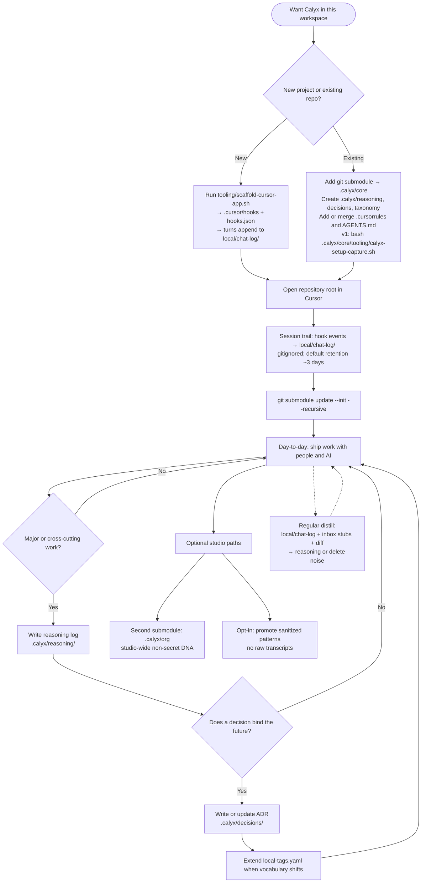

# Calyx UX flow

How someone goes from **“we want Calyx in our workspace”** to **steady habits** in the repo. For step-by-step commands, see [new-project.md](new-project.md).

## Incorporation flow

## Reading the diagram

| Stage | What the user experiences |
|-------|---------------------------|
| **New vs existing** | Green field gets a one-command scaffold; brown field gets a short Git + folder merge—no rewrites. |
| **Cursor** | Workspace root = whole repo so `.cursorrules` applies everywhere. |
| **Session trail** | **Calyx v1** expects **Cursor hooks** so each turn appends under **`local/chat-log/`**—raw material for distill. Install with **`calyx-setup-capture.sh`** or scaffold. See [cursor-local-chat-log.md](cursor-local-chat-log.md). |
| **Submodule** | `.calyx/core` is the pinned calyx-core bundle; init once per clone. |
| **Distill rhythm** | Use recent **`local/chat-log/*.md`** with **inbox stubs** ([automation.md](automation.md)) and **git diff** so “why” in chat can land in **`.calyx/reasoning/`** without retyping. For **cpl → col** and taxonomy, follow **`.calyx/AGENT_ROLES.md`** after **`calyx-install-agent-roles.sh`**. |
| **Major work gate** | Not every edit gets a log—only work where “why” should survive. |
| **ADR** | For choices that constrain tomorrow’s work; supersede, don’t silently rewrite. |
| **Optional studio** | Org layer for agency defaults; “commons” only when explicitly sanitized and shared. |

## Automation in the loop (quick reference)

| Mechanism | Output | Doc |
|-----------|--------|-----|
| **`calyx-setup-capture.sh`** | Installs git + Cursor capture (v1 baseline) | [automation.md](automation.md) |
| **Cursor hooks** + script | `local/chat-log/YYYY-MM-DD.md` (rolling retention) | [cursor-local-chat-log.md](cursor-local-chat-log.md) |
| **Post-commit hook** | `.calyx/reasoning/inbox/*.md` stubs | [automation.md](automation.md) |
| **Human / Librarian distill** | `.calyx/reasoning/` entries, ADRs when ratified | [workflow.md](workflow.md) |

## Related

- [first-run.md](first-run.md) — prerequisites, **why**, checklist; agent playbook for onboarding
- [new-project.md](new-project.md) — scripts, flags, deliverables
- [cursor-local-chat-log.md](cursor-local-chat-log.md) — install, limits, retention env var
- [automation.md](automation.md) — post-commit inbox stubs
- [workflow.md](workflow.md) — ongoing Calyx **work** rhythm (reasoning, ADRs, checkpoint)
- [glossary.md](glossary.md) — **ccl** / **col** / **cpl**
- [README](../README.md) — repo overview and quick commands
