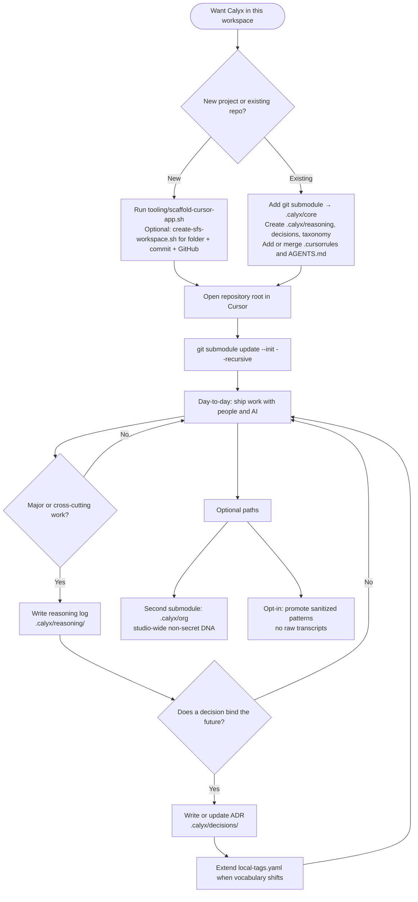

# Calyx UX flow

How someone goes from **“we want Calyx in our workspace”** to **steady habits** in the repo. For step-by-step commands, see [new-project.md](new-project.md).

## Incorporation flow

## Reading the diagram

| Stage | What the user experiences |
|-------|---------------------------|
| **New vs existing** | Green field gets a one-command scaffold; brown field gets a short Git + folder merge—no rewrites. |
| **Cursor** | Workspace root = whole repo so `.cursorrules` applies everywhere. |
| **Submodule** | `.calyx/core` is the pinned calyx-core bundle; init once per clone. |
| **Major work gate** | Not every edit gets a log—only work where “why” should survive. |
| **ADR** | For choices that constrain tomorrow’s work; supersede, don’t silently rewrite. |
| **Optional** | Org layer for agency defaults; “commons” only when explicitly sanitized and shared. |

## Related

- [new-project.md](new-project.md) — scripts, flags, deliverables
- [workflow.md](workflow.md) — ongoing Calyx **work** rhythm (reasoning, ADRs, checkpoint)
- [glossary.md](glossary.md) — **ccl** / **col** / **cpl**
- [README](../README.md) — repo overview and quick commands
