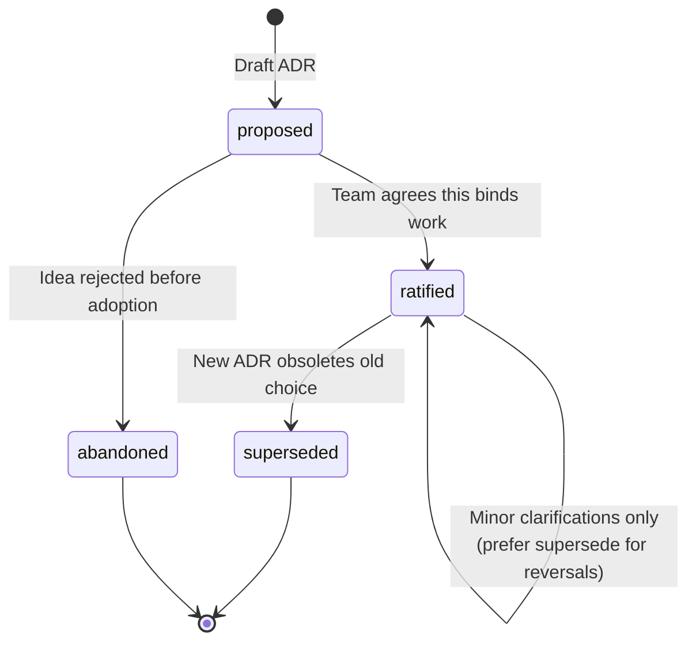

# Calyx workflow

**Living document.** This page describes the **ongoing work rhythm** after onboarding (contrast: [ux-flow.md](ux-flow.md)). When Calyx habits, templates, or tooling change materially, **update this file** and note it in `manifest.yaml` / release notes so downstream repos know to refresh expectations.

---

## Work rhythm (diagram)

**Checkpoint detail:** see **`templates/calyx-closeout.md`** in this repo (mounted as **`.calyx/core/templates/calyx-closeout.md`** in projects) and **`tooling/calyx-closeout.sh`**.

---

## Stage guide

| Stage | Intent | Typical artifacts |
|-------|--------|-------------------|
| **Work** | Ship value; use AI like a teammate, not a black box. | Code, tests, product docs. |
| **Major gate** | Avoid logging noise; **do** log when “why” should survive the week. | — |
| **Reasoning log** | Chronological + options + outcome; dead ends are valuable. | `.calyx/reasoning/*.md` |
| **Specialists** | Optional prompts for challenge, summary, cross-team visibility. | Paste or run against session notes. |
| **ADR** | Ratify what future-you must not re-litigate silently. | `.calyx/decisions/ADR-*.md` |
| **Tags** | Keep local vocabulary aligned with `master-tags.yaml`. | `local-tags.yaml` |
| **Link** | Make the brain navigable from delivery work. | PR description, footnotes in tickets. |
| **Checkpoint** | Brain is not “local only” by accident. | `git commit` / `git push` |

---

## ADR lifecycle (compact)

When **superseding**, keep the old ADR file and record **Supersedes** / **Superseded by** links—do not rewrite history for tidiness.

---

## Commit-triggered inbox stubs (opt-in)

Install **`tooling/install-calyx-git-hooks.sh`** so **post-commit** writes **`.calyx/reasoning/inbox/auto-*.md`** for substantive commits; distill with **`prompts/distill-inbox-stub-onepager.txt`**. Full detail: [automation.md](automation.md).

## Bootstrapping from Slack / email exports

Raw exports are **mostly chaff**. Use an agent (or a human) to **classify, summarize, and structure**—not to archive full threads in Git.

**Runbook (for agents):** [`templates/distill-external-to-calyx.md`](../templates/distill-external-to-calyx.md) — produces a **reasoning log draft** and an **ADR stub** only when a binding decision exists; includes participant **authority tiers** (BINDING / ACCOUNTABLE / …), redaction, and handoff steps.

**One-pager (paste-ready):** [`prompts/import-distill-onepager.txt`](../prompts/import-distill-onepager.txt) — same intent in a single block for Cursor or other LLM front ends.

---

## Related

| Doc | Focus |
|-----|--------|
| [ux-flow.md](ux-flow.md) | First-time incorporation (scaffold vs brownfield, Cursor, submodule). |
| [new-project.md](new-project.md) | Scripts, flags, deliverables for new repos. |
| [README](../README.md) | Repo overview and quick commands. |
| [distill-external-to-calyx.md](../templates/distill-external-to-calyx.md) | Import / distillation runbook for noisy exports |
| [import-distill-onepager.txt](../prompts/import-distill-onepager.txt) | Paste-ready import distillation prompt |
| [glossary.md](glossary.md) | **ccl** / **col** / **cpl** layer abbreviations |
| [org-and-projects.md](org-and-projects.md) | Agency/org vs project repos |
| [automation.md](automation.md) | Post-commit inbox stubs, skip flags, distill |
| [cursor-local-chat-log.md](cursor-local-chat-log.md) | Cursor hooks → `local/chat-log/` for optional EOD distill |
