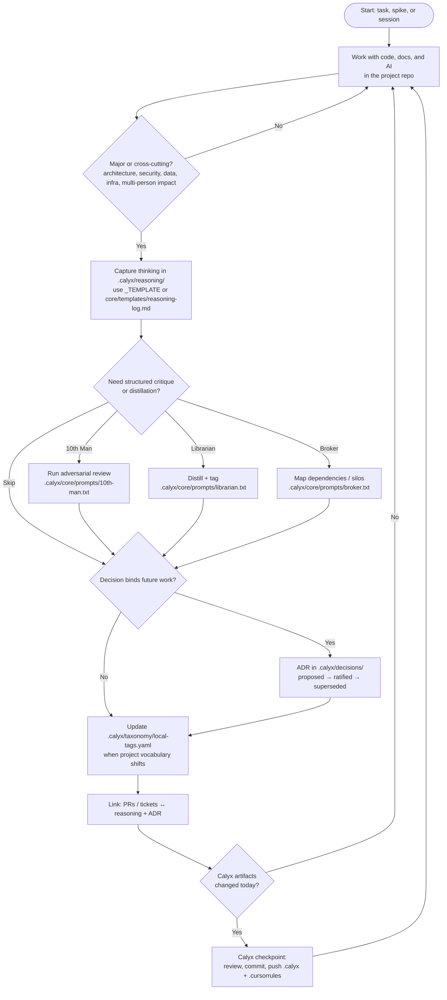
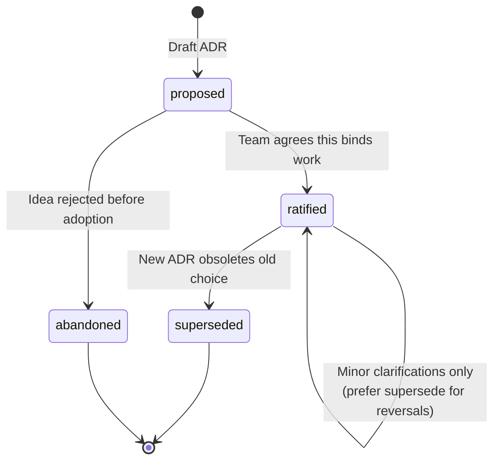

# Calyx workflow

**Living document.** This page describes the **ongoing work rhythm** after onboarding (contrast: [ux-flow.md](ux-flow.md)). When Calyx habits, templates, or tooling change materially, **update this file** and note it in `manifest.yaml` / release notes so downstream repos know to refresh expectations.

**Calyx v1:** keep **capture** installed (**`calyx-setup-capture.sh`**). The rhythm below assumes **inbox stubs** and **`local/chat-log/`** exist as **inputs** to distill; without them you are back to memory and commit blurbs.

---

## Work rhythm (diagram)

**Checkpoint detail:** see **`templates/calyx-closeout.md`** in this repo (mounted as **`.calyx/core/templates/calyx-closeout.md`** in projects) and **`tooling/calyx-closeout.sh`**.

---

## Stage guide

| Stage | Intent | Typical artifacts |
|-------|--------|-------------------|
| **Work** | Ship value; use AI like a teammate, not a black box. | Code, tests, product docs. |
| **Major gate** | Avoid logging noise; **do** log when “why” should survive the week. | — |
| **Reasoning log** | Chronological + options + outcome; dead ends are valuable. | `.calyx/reasoning/*.md` |
| **Specialists** | Optional prompts for challenge, summary, cross-team visibility. | Paste or run against session notes. |
| **ADR** | Ratify what future-you must not re-litigate silently. | `.calyx/decisions/ADR-*.md` |
| **Tags** | Keep local vocabulary aligned with `master-tags.yaml`. | `local-tags.yaml` |
| **Link** | Make the brain navigable from delivery work. | PR description, footnotes in tickets. |
| **Checkpoint** | Brain is not “local only” by accident. | `git commit` / `git push` |

---

## ADR lifecycle (compact)

When **superseding**, keep the old ADR file and record **Supersedes** / **Superseded by** links—do not rewrite history for tidiness.

---

## Commit-triggered inbox stubs (opt-in)

Install **`tooling/install-calyx-git-hooks.sh`** so **post-commit** writes **`.calyx/reasoning/inbox/auto-*.md`** for substantive commits; distill with **`prompts/distill-inbox-stub-onepager.txt`**. Full detail: [automation.md](automation.md).

## Thin EOW governance (weekly)

Use **`bash .calyx/core/tooling/calyx-eow-governance.sh`** from the project root for a report-first weekly sweep:

- intake manifest,
- distillation status ledger updates,
- hygiene/consistency findings,
- 10th Man trigger decision,
- single markdown report + JSON artifacts.

Docs and config template: [eow-governance.md](eow-governance.md).

## Knowledge feedback loop (apply + enforce)

Use **`bash .calyx/core/tooling/calyx-feedback-loop.sh`** for mode-aware compliance checks:

- classify changes (`trivial`, `feature_local`, `cross_cutting`, `architecture_binding`, `uncertain`),
- evaluate required evidence by class,
- emit deterministic remediation output (JSON + markdown),
- support `learn` -> `guided` -> `guardrail` rollout.

Docs and policy template: [feedback-loop.md](feedback-loop.md). Adoption/playbook: [adr-adoption-checklist.md](adr-adoption-checklist.md).

## Org lift (**cpl** → **col**) and taxonomy

**Org lift** is the preferred name for moving **sanitized, reusable** **cpl** knowledge into **col** (AI-guided; human merges). It is **not** auto-merged by Git hooks.

| Goal | Prompt | Template / index |
|------|--------|------------------|
| Run the lift (draft org PR) | **`prompts/promote-cpl-to-col.txt`** | **`.calyx/AGENT_ROLES.md`** |
| **Cadence + assistant nudges** (checkpoint, milestones, monthly) | **`prompts/org-lift-cadence.txt`** | Pair with **`templates/calyx-closeout.md`** |
| Keep **`local-tags.yaml`** aligned with **`master-tags.yaml`** | **`prompts/librarian-taxonomy-sync.txt`** | **`templates/librarian-taxonomy-review.md`** |

**Install / backfill** the project index: **`bash .calyx/core/tooling/calyx-install-agent-roles.sh`** (runs automatically at the end of **`calyx-setup-capture.sh`**; use **`--force`** to reset **`.calyx/AGENT_ROLES.md`** from core).

## Bootstrapping from Slack / email exports

Raw exports are **mostly chaff**. Use an agent (or a human) to **classify, summarize, and structure**—not to archive full threads in Git.

**Runbook (for agents):** [`templates/distill-external-to-calyx.md`](../templates/distill-external-to-calyx.md) — produces a **reasoning log draft** and an **ADR stub** only when a binding decision exists; includes participant **authority tiers** (BINDING / ACCOUNTABLE / …), redaction, and handoff steps.

**One-pager (paste-ready):** [`prompts/import-distill-onepager.txt`](../prompts/import-distill-onepager.txt) — same intent in a single block for Cursor or other LLM front ends.

---

## Related

| Doc | Focus |
|-----|--------|
| [philosophy.md](philosophy.md) | Stewardship vs extraction; epistemic framing |
| [github-repository-setup.md](github-repository-setup.md) | Public repo, description, topics, `gh` examples |
| [why-calyx-now.md](why-calyx-now.md) | One-page case: org intelligence, capture, why now |
| [ux-flow.md](ux-flow.md) | First-time incorporation (scaffold vs brownfield, Cursor, submodule). |
| [new-project.md](new-project.md) | Scripts, flags, deliverables for new repos. |
| [README](../README.md) | Repo overview and quick commands. |
| [distill-external-to-calyx.md](../templates/distill-external-to-calyx.md) | Import / distillation runbook for noisy exports |
| [import-distill-onepager.txt](../prompts/import-distill-onepager.txt) | Paste-ready import distillation prompt |
| [glossary.md](glossary.md) | **ccl** / **col** / **cpl** layer abbreviations |
| [org-and-projects.md](org-and-projects.md) | Agency/org vs project repos |
| [automation.md](automation.md) | Post-commit inbox stubs, skip flags, distill |
| [calyx-status-report.md](calyx-status-report.md) | v1 status report — hooks, capture, decision memory, EOW/feedback, org lift |
| [eow-governance.md](eow-governance.md) | Thin weekly governance runner (manifest + conflicts + trigger + report) |
| [feedback-loop.md](feedback-loop.md) | Capture -> distill -> apply -> enforce loop (mode-aware) |
| [adr-adoption-checklist.md](adr-adoption-checklist.md) | ADR backflow checklist for planning, review, CI, and weekly governance |
| [cursor-first-showcase.md](cursor-first-showcase.md) | Cursor-native architecture brief and demo path |
| [experiments-and-future.md](experiments-and-future.md) | Design directions outside the manifest until promoted; legend + scope recap |
| [impact-telemetry.md](impact-telemetry.md) | Reference: release-boundary audits, optional metrics, ROI estimates |
| [decisions/ADR-0001-governance-feedback-and-deferred-telemetry.md](decisions/ADR-0001-governance-feedback-and-deferred-telemetry.md) | Shipped governance/feedback vs deferred continuous metrics (**2026-05-07**) |
| [cursor-local-chat-log.md](cursor-local-chat-log.md) | Cursor hooks → `local/chat-log/` (v1 baseline; feed distill) |
| [../prompts/README.md](../prompts/README.md) | Specialist + org lift + taxonomy prompts |
| [releasing.md](releasing.md) | **`v1.x.y`** tags and pre-flight checklist |
